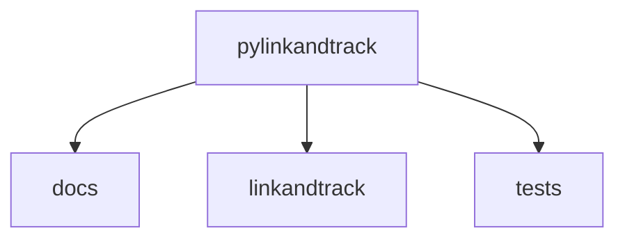
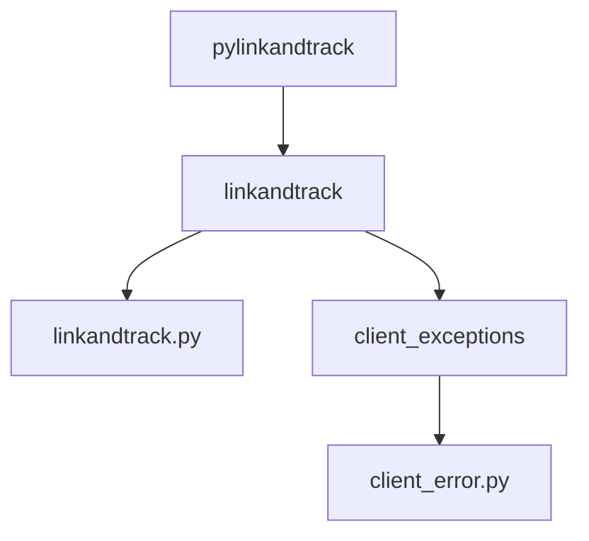

# Como contribuir

Obrigado por se interessar por contribuir no projeto `PyLinkAndTrack` :smile::heart:. Nesse documento estão listadas as operações mais comuns e que você pode precisar para contribuir.

## Como o projeto funciona?

### Estrutura do projeto

O projeto é dividido em três diretórios. `docs`, `linkandtrack` e `tests`. Onde cada diretório tem sua função especifica.

#### linkandtrack

O código da biblioteca estão em `linkandtrack`. A documentação da API do código também está sendo feita em 
`linkandtrack`. Com uso da ferramenta [mkdocstrings](https://mkdocstrings.github.io/) e seguem o padrão de 
[docstrings do google](https://sphinxcontrib-napoleon.readthedocs.io/en/latest/example_google.html). Então, caso altere 
alguma coisa no código, lembre-se de atualizar também as docstrings.

Os exemplos usados na docstring também estão sendo usados para testes. Então, caso altere o formato de saída, lembre-se 
de atualizar as docsintrgs.

### Como clonar o repositório

### Como executar a verificação de código

### Como executar os testes

### Como executar a documentação

